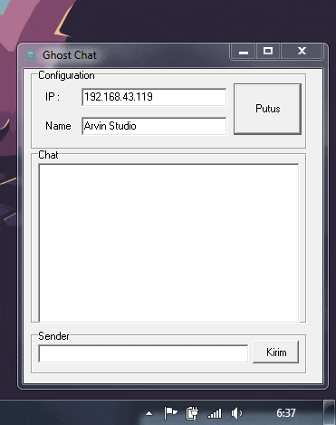
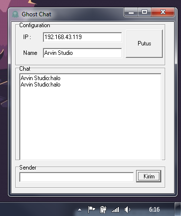

# GhostChat

# Ghost Chat

Ghost Chat adalah aplikasi LAN Chat sederhana yang memungkinkan pengguna untuk berkomunikasi dalam jaringan lokal dengan mudah dan cepat. Aplikasi ini dirancang untuk memfasilitasi obrolan antar pengguna dalam suatu jaringan lokal tanpa perlu koneksi internet. 

## Fitur Utama

- Obrolan Grup: Anda dapat membuat dan bergabung dalam obrolan grup untuk berkomunikasi dengan banyak pengguna sekaligus.
- Obrolan Pribadi: Anda juga dapat memulai obrolan pribadi dengan pengguna lain di dalam jaringan LAN.
- Tampilan Pesan: Tampilan yang bersih dan sederhana untuk melihat pesan yang dikirim dan diterima.
- Notifikasi: Notifikasi pesan baru untuk memastikan Anda tidak melewatkan pesan yang penting.
- Riwayat Obrolan: Anda dapat melihat riwayat obrolan untuk merujuk kembali ke pesan sebelumnya.

## Persyaratan Sistem

- Sistem Operasi: Aplikasi ini dapat dijalankan pada Windows, macOS, dan Linux.
- Jaringan Lokal: Koneksi ke jaringan lokal diperlukan untuk berkomunikasi dengan pengguna lain dalam jaringan.

## Cara Menggunakan Ghost Chat

1. Unduh Ghost Chat dari repositori ini.
2. Instal aplikasi sesuai dengan sistem operasi yang Anda gunakan.
3. Buka aplikasi Ghost Chat.
4. Daftar atau masuk ke akun Anda.
5. Bergabung dalam obrolan grup yang ada atau mulai obrolan pribadi dengan pengguna lain dalam jaringan lokal.
6. Mulai mengirim dan menerima pesan dengan pengguna lain.

## Pengembangan Aplikasi

Jika Anda ingin berkontribusi pada pengembangan Ghost Chat, berikut beberapa langkah yang dapat Anda lakukan:

1. Clone repositori ini ke komputer Anda.
2. Buat branch baru untuk fitur atau perbaikan yang ingin Anda tambahkan.
3. Lakukan perubahan yang diperlukan.
4. Buat pull request untuk mengusulkan perubahan Anda.

## Lisensi

Ghost Chat dilisensikan di bawah [lisensi MIT](LICENSE). Anda bebas menggunakan, menyalin, memodifikasi, atau mendistribusikan perangkat lunak ini sesuai dengan ketentuan lisensi.

## Kontak

Jika Anda memiliki pertanyaan, masukan, atau saran terkait Ghost Chat, Anda dapat menghubungi kami di [fajarjulyana1@gmail.com](mailto:fajarjulyana1@gmail.com).

Terima kasih telah menggunakan Ghost Chat! Kami harap aplikasi ini bermanfaat untuk komunikasi dalam jaringan lokal Anda.

## Dokmentasi

